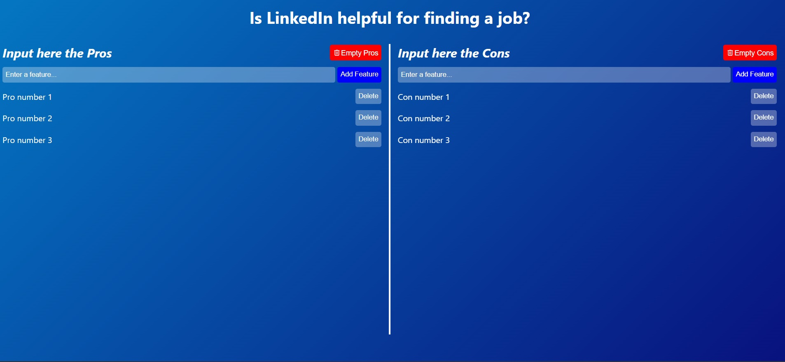

# React-Redux Application about PROS AND CONS created with React + TypeScript + Vite

## Here is how this simple App looks like



## This summarizes the primary data flow in my application.

## Initialization

- The application starts by rendering the `main.tsx` file.
- It creates a Redux store using the combined reducer (`rootReducer`) from `store.ts`.

## Rendering the App Component

- The `App` component is rendered inside the `Provider` from the `react-redux` library in `main.tsx`.
- The `Provider` makes the Redux store available to the entire component tree.

## Rendering Feature Types

- The `App` component maps over `featureTypes` (Pros and Cons) and renders a separate side for each.
- Each side contains a `FeatureForm` and a `FeatureList` for the corresponding feature type.

## FeatureForm Component

- The `FeatureForm` component renders an input form to add new features.
- When a user submits the form, it dispatches the `addFeat` action with the feature text and type.

## Redux Action Dispatch

- The `addFeat` action is dispatched, including a randomly generated ID, the feature text, and the feature type.
- The action is processed by the `featReducer`, which updates the Redux store by adding the new feature to the array.

## FeatureList Component

- The `FeatureList` component subscribes to changes in the Redux store using `useSelector`.
- It filters and maps over the features based on the current feature type and renders `FeatureItem` components for each feature.

## FeatureItem Component

- The `FeatureItem` component displays an individual feature along with a delete button.
- When the delete button is clicked, the `deleteFeat` action is dispatched with the feature's ID.

## Redux Action Dispatch (Delete)

- The `deleteFeat` action is processed by the `featReducer`, which updates the Redux store by removing the feature with the corresponding ID.

## Empty Store Button

- The `emptyStoreHandler` function in the `App` component dispatches the `emptyStore` action when the "Empty" button is clicked.
- This action is processed by the `featReducer`, which removes all features of the specified type from the Redux store.

## Local Storage Interaction

- The `FeatureList` component includes a `useEffect` hook that listens for the `beforeunload` event and saves the current features to Local Storage.
- This allows the application to persist data between page reloads.

Actions are dispatched to the Redux store, and components subscribe to the store to reflect changes in the UI. Local Storage is used to persist data between sessions.

Currently, two official plugins are available:

- [@vitejs/plugin-react](https://github.com/vitejs/vite-plugin-react/blob/main/packages/plugin-react/README.md) uses [Babel](https://babeljs.io/) for Fast Refresh
- [@vitejs/plugin-react-swc](https://github.com/vitejs/vite-plugin-react-swc) uses [SWC](https://swc.rs/) for Fast Refresh

## Expanding the ESLint configuration

If you are developing a production application, we recommend updating the configuration to enable type aware lint rules:

- Configure the top-level `parserOptions` property like this:

```js
   parserOptions: {
    ecmaVersion: 'latest',
    sourceType: 'module',
    project: ['./tsconfig.json', './tsconfig.node.json'],
    tsconfigRootDir: __dirname,
   },
```

- Replace `plugin:@typescript-eslint/recommended` to `plugin:@typescript-eslint/recommended-type-checked` or `plugin:@typescript-eslint/strict-type-checked`
- Optionally add `plugin:@typescript-eslint/stylistic-type-checked`
- Install [eslint-plugin-react](https://github.com/jsx-eslint/eslint-plugin-react) and add `plugin:react/recommended` & `plugin:react/jsx-runtime` to the `extends` list
